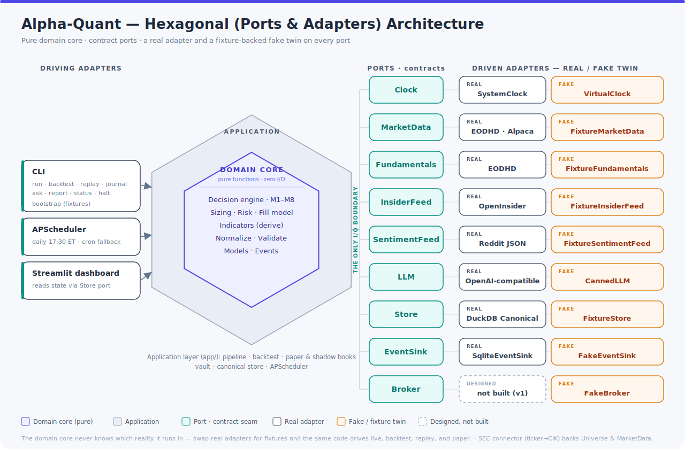
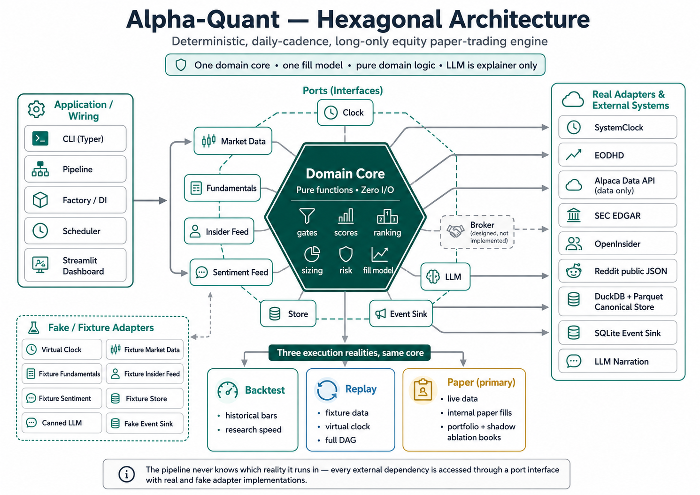

<div align="center">

<div align="center">
  
</div>

# Alpha-Quant

Deterministic, daily-cadence, long-only equity paper-trading engine

[](https://github.com/mblaauw/alpha-quant/actions)
[](https://github.com/mblaauw/alpha-quant/milestone/8)
[](https://python.org)
[](https://github.com/astral-sh/ty)
[](https://github.com/astral-sh/ruff)
[](LICENSE)

</div>

---

## Overview

Alpha-Quant is a deterministic, daily-cadence, long-only equity paper-trading system built on a ports-and-adapters (hexagonal) architecture. All market, fundamental, insider, and sentiment data is sourced through **Alpha-Lake** (a separate data-plane system) via the `LakeGateway` port. The engine evaluates US equities through a multi-mechanism decision engine (M1–M8), runs a conservative fill model shared across backtest and paper modes, and generates structured trading decisions with LLM-narrated daily journals.

**Who is this for?** Quantitative researchers and algorithmic traders who want to prototype, backtest, and paper-trade systematic equity strategies without a broker dependency. The system is designed for research transparency — every mechanism has an ablation counterpart for walk-forward validation, and the core domain logic is pure Python with zero I/O.

**What problem does it solve?** Bridging the gap between strategy research and paper execution with:
- A single fill model across backtest, paper, replay, and shadow books (no simulated/real divergence)
- Mechanism-level attribution (which factors drove each decision)
- Walk-forward validation infrastructure (shadow books that isolate each mechanism's contribution)
- Deterministic replay for auditability

> **⚠️ Beta status:** This is a research/paper-trading system. It is **not financial advice**. The decision engine is fully wired (8/8 mechanisms; M1 uses a configured universe list in the pipeline; M2 SPY path is live, VIX/breadth use defaults). See [Beta Release milestone](https://github.com/mblaauw/alpha-quant/milestone/8) for open items.

### Key Principles

- **Deterministic** — same config + same data = same decisions, every run (I7)
- **Degrade, never block** — source failures degrade gracefully; only price staleness halts
- **One fill model** — backtest, replay, paper, and shadow books all share the same conservative fill semantics (`domain/fills.py`)
- **LLM is explainer only** — never in the decision path; narration polishes recorded reasoning
- **Walk-forward by design** — every mechanism has an ablation shadow book; if removal improves performance, the mechanism is flagged for review. Live ablation runs on every pipeline execution

## Quick Start

```bash
# Clone
git clone https://github.com/mblaauw/alpha-quant.git
cd alpha-quant

# Install
uv sync

# Configure (create local config)
cp config.local.toml.example config.local.toml

# Bootstrap fixtures
uv run alpha-quant bootstrap

# Run tests
uv run pytest
```

## Architecture

Alpha-Quant follows a **ports-and-adapters (hexagonal) architecture** where the domain core has zero I/O and every external dependency is accessed through a port interface with both fake and real adapter implementations.

<div align="center">
  
</div>
<div align="center">
  
</div>

### Layer Rules

| Layer | Can Import | Cannot Import |
|-------|-----------|---------------|
| `domain/` | Python stdlib, numpy, pydantic | `app/`, `adapters/`, `ports/` |
| `ports/` | `domain/` (types only) | `adapters/`, `app/` |
| `adapters/` | `ports/`, `domain/` (types only) | `app/` |
| `app/` | `domain/`, `ports/` | — |

### Decision Mechanisms (M1–M8)

| ID | Mechanism | Domain Logic | Runtime Wiring | Notes |
|----|-----------|:------------:|:--------------:|-------|
| **M1** | Universe | ✅ Implemented | ✅ Wired | `universe.select` is wired in the pipeline; bootstrap reads `[bootstrap].symbols` from config |
| **M2** | Regime | ✅ Implemented | ✅ Wired | SPY EMA50/200 path live; VIX/breadth use hardcoded defaults unless overridden |
| **M3** | Technical | ✅ Implemented | ✅ Wired | Trend, RSI (Gaussian 52±22), MACD, volume, ATR |
| **—** | Momentum | ✅ Implemented | ✅ Wired | 63-day (~3-month) lookback, bucketed score |
| **M4** | Quality | ✅ Implemented | ✅ Wired | Fundamental gate (operating cash flow, D/E, accruals) |
| **M5** | Insider | ✅ Implemented | ✅ Wired | Buy cluster boost; c-suite sell penalty (.05 per sell, max .30) |
| **M6** | Crowding | ✅ Implemented | ✅ Wired | 14-day block on z>3; configurable via `_BLOCK_DAYS` |
| **M7** | Blackout | ✅ Implemented | ✅ Wired | 3-day pre-earnings entry block |
| **M8** | Composite | ✅ Implemented | ✅ Wired | 0.6·technical + 0.25·momentum + 0.15·insider; equal-weight sector cap (25% of slots) |

> Each mechanism's runtime path is verified by pipeline behavioral tests (550 tests). See [BETA-DA-8](https://github.com/mblaauw/alpha-quant/issues/334).

## Data Plane

All market data flows through **Alpha-Lake**, a separate data-plane system accessed via the `LakeGateway` port (`ports/lake.py`). Every read is a point-in-time (PIT) query clock-driven by `as_of` — the pipeline never ingests raw data directly.

| Adapter | File | Mode | Description |
|---------|------|------|-------------|
| **InProcessLakeGateway** | `adapters/real/lake_inprocess.py` | in_process | Imports `alpha_lake` library in-process; connects to DuckDB catalog |
| **FixtureLakeGateway** | `adapters/fake/lake_fixture.py` | fixture | Reads fixture Parquet with PIT visibility for deterministic replay |
| **RestLakeGateway** | *(deferred)* | rest | Raises `NotImplementedError` — planned for lake REST serving |

The `LakeMarketData`, `LakeFundamentals`, `LakeInsiderFeed`, and `LakeSentimentFeed` wrappers (`adapters/real/lake_data.py`) implement the individual domain port interfaces by delegating to `LakeGateway`.

Degradation is derived from `LakeGateway.dataset_health()` — per-dataset staleness and availability determine which mechanisms degrade and whether price staleness triggers a halt.

## CLI Commands

| Command | Status | Description |
|---------|--------|-------------|
| `alpha-quant bootstrap` | ✅ Ready | Generate deterministic fixture data for development |
| `alpha-quant replay` | ✅ Ready | Full-DAG golden replay over fixture data |
| `alpha-quant run` | ✅ Ready | Daily pipeline — PIT reads from Alpha-Lake, drives full decision DAG |
| `alpha-quant backtest` | ✅ Ready | Event-driven backtester (single fill model) |
| `alpha-quant journal` | ✅ Ready | Daily journal with LLM narration |
| `alpha-quant ask` | ✅ Ready | Query recorded decisions and events |
| `alpha-quant report` | ✅ Ready | Weekly/monthly reports (from DB or latest snapshot) |
| `alpha-quant status` | ✅ Ready | Full system status (portfolio, equity, positions, risk) |
| `alpha-quant halt` | ✅ Ready | Halt or resume pipeline |
| `alpha-quant schedule` | ✅ Ready | Start/stop the APScheduler daily scheduler |
| `alpha-quant backup` | ✅ Ready | Backup DuckDB state store |

## Documentation

| Document | Description |
|----------|-------------|
| [Design Specification](DESIGN.md) | Full system design (v1.2) |
| [Architecture Diagrams](docs/architecture/README.md) | C4 model (LikeC4 DSL) |
| [ADR Log](docs/adr/README.md) | 34 Architecture Decision Records |
| [Concept Cards](src/app/concepts/) | 21 mechanism descriptions (ablation, ATR, crowding, momentum, etc.) |
| [GitHub Issues](https://github.com/mblaauw/alpha-quant/issues) | Active backlog — prioritised by P0–P3 |
| [Roadmap](docs/planning/ROADMAP.md) | Beta release status and known limitations |

## Development

```bash
make check          # Ruff lint
make format         # Ruff format
make type           # Type check src/ (CI-equivalent)
make bootstrap      # Generate fixtures
uv run pytest       # Run tests (550 passing)
make bless-golden   # Update golden replay fixture hash
```

## Configuration

Secrets are **never committed** to the repository. Use one of:

1. **`config.local.toml`** (recommended for local dev) — gitignored, merged on top of `config.toml`
2. **Environment variables** — `ALPHA_QUANT_LLM__API_KEY=...` (takes highest precedence)

Data-collection API keys (Tiingo, EODHD, SEC, OpenInsider, Reddit) are **no longer needed** — all market data is sourced through Alpha-Lake. Alpaca API keys remain only for the broker adapter (inactive in v1).

See [config.local.toml.example](config.local.toml.example) for available options.

## Tech Stack

| Component | Choice |
|-----------|--------|
| Runtime | Python 3.14 |
| Package manager | uv |
| Config | pydantic-settings + TOML |
| Domain models | Pydantic v2 (frozen) |
| Indicators | numpy (incremental O(1)) |
| Analytical SQL | DuckDB |
| Columnar storage | pyarrow (Parquet, zstd) |
| Data plane | **Alpha-Lake** (separate system; all market/fundamental/insider/sentiment data sourced via `LakeGateway` port) |
| CLI | Typer + Rich |
| Logging | structlog (JSON) |
| Testing | pytest |
| Linting | ruff (lint + format) |
| Type checking | ty (astral) |

## License

MIT
