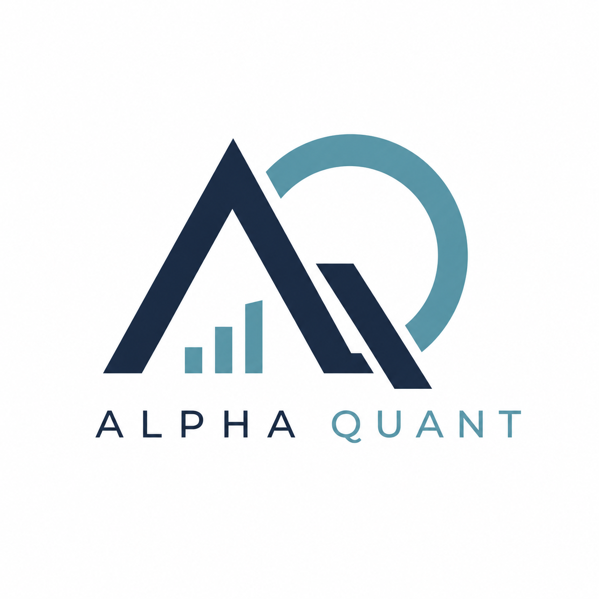

<div align="center">

<div align="center">
  
</div>
# Alpha-Quant

Deterministic, daily-cadence, long-only equity trading system

[](https://github.com/mblaauw/alpha-quant/actions)
[](https://python.org)
[](https://github.com/astral-sh/ty)
[](https://github.com/astral-sh/ruff)
[](LICENSE)

</div>

---

## Overview

Alpha-Quant is a deterministic, daily-cadence, long-only equity trading system with an **internal paper-trading engine** — no broker dependency. The system uses a ports-and-adapters (hexagonal) architecture where the domain core contains zero I/O and every connector has a fixture-backed fake twin.

**Key principles:**
- **Deterministic** — same config + same data = same decisions, every run
- **Degrade, never block** — source failures degrade gracefully; only price staleness halts
- **One fill model** — backtest, replay, paper, and shadow books all share the same conservative fill semantics
- **LLM is explainer only** — never in the decision path; narration polishes recorded reasoning
- **Walk-forward by design** — ≤3 tuned parameters, every mechanism beats its ablation or is flagged off

## Quick Start

```bash
# Clone
git clone https://github.com/mblaauw/alpha-quant.git
cd alpha-quant

# Install
uv sync

# Configure (create local config with your API keys)
cp config.local.toml.example config.local.toml
# Edit config.local.toml — API keys never leave your machine

# Bootstrap fixtures
uv run alpha-quant bootstrap

# Run tests
uv run pytest
```

## Architecture

Alpha-Quant implements a **medallion architecture** with four strict zones:

```
CONNECTORS          RAW VAULT          CANONICAL STORE        DECISION ENGINE
  EODHD         ┌─────────────┐   ┌──────────────────┐   ┌──────────────────┐
  Alpaca   ────▶│ append-only │──▶│ Parquet (bars)   │──▶│ M1–M8 mechanisms │
  SEC      ────▶│ zstd blobs  │   │ DuckDB (state)   │   │ risk, sizing,    │
  OpenIns. ────▶│ + manifest  │   │                  │   │ fill model       │
  Reddit   ────▶│             │   │                  │   │ paper engine     │
                └─────────────┘   └──────────────────┘   └──────────────────┘
```

### Decision Mechanisms (M1–M8)

| Module | Purpose |
|--------|---------|
| **M1** Universe | Filter by liquidity, price, SEC validity |
| **M2** Regime | RISK_ON / CAUTION / RISK_OFF (SPY EMA50/200) |
| **M3** Technical | Trend, momentum, RSI, MACD, volume, ATR |
| **M4** Quality | OCF, D/E, accruals, earnings surprise |
| **M5** Insider | Cluster signal (Cohen/Malloy/Pomorski 2012) |
| **M6** Crowding | Reddit mention z-score veto |
| **M7** Blackout | Earnings blackout window |
| **M8** Composite | Weighted ranking + gates |

### Documentation

| Document | Description |
|----------|-------------|
| [Design Specification](DESIGN.md) | Full system design (v1.2) |
| [Architecture Diagrams](docs/architecture/README.md) | C4 model (LikeC4) |
| [ADR Log](docs/adr/README.md) | 21 Architecture Decision Records → now 26 |
| [Backlog](docs/planning/BACKLOG.md) | Full project backlog |
| [Roadmap](docs/planning/ROADMAP.md) | Implementation roadmap |

## CLI Commands

| Command | Status | Description |
|---------|--------|-------------|
| `alpha-quant bootstrap` | ✅ Ready | Generate deterministic fixture data for development |
| `alpha-quant replay` | 🔨 Stub | Golden replay (incremental wiring in progress) |
| `alpha-quant run` | 📋 Planned | Daily pipeline (P2.14) |
| `alpha-quant backtest` | 📋 Planned | Event-driven backtester (P2.13) |
| `alpha-quant journal` | 📋 Planned | Daily journal with LLM narration (P4.5) |
| `alpha-quant ask` | 📋 Planned | Query recorded decisions (P4.8) |
| `alpha-quant report` | 📋 Planned | Weekly/monthly reports (P4.6) |
| `alpha-quant status` | 📋 Planned | Full system status (P5.4) |
| `alpha-quant halt` | 📋 Planned | Halt or resume pipeline (P5.4) |

## Development

```bash
make check          # Ruff lint
make format         # Ruff format
make type           # Type check
make bootstrap      # Generate fixtures
uv run pytest       # Run tests
```

## Configuration

API keys and secrets are **never committed** to the repository. Use one of:

1. **`config.local.toml`** (recommended for local dev) — gitignored, merged on top of `config.toml`
2. **Environment variables** — `ALPHA_QUANT_EODHD__API_KEY=...` (takes highest precedence)

See [config.local.toml.example](config.local.toml.example) for available options.

## Tech Stack

| Component | Choice |
|-----------|--------|
| Runtime | Python 3.14 |
| Package manager | uv |
| Config | pydantic-settings + TOML |
| Domain models | Pydantic v2 (frozen) |
| Indicators | numpy (incremental O(1)) |
| Analytical SQL | DuckDB |
| Columnar storage | pyarrow (Parquet, zstd) |
| HTTP | httpx + tenacity retry |
| Logging | structlog (JSON) |
| Testing | pytest + hypothesis |

## License

MIT
